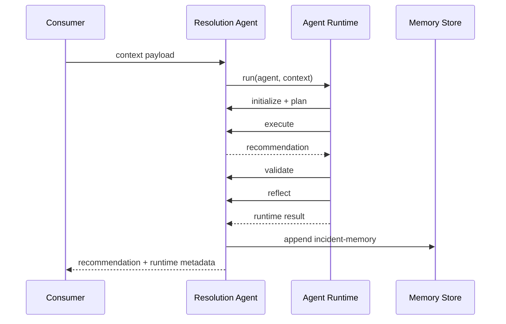
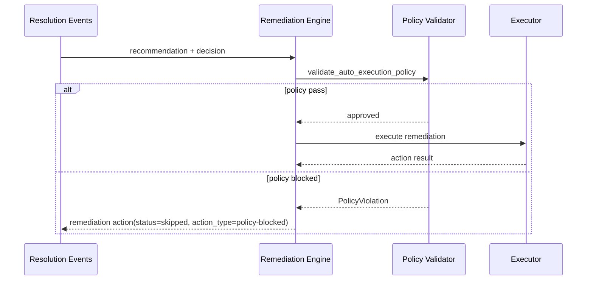

# Agentic Architecture Incremental Refactor

## Why this change

KaiOps already had strong service-level decomposition, but agent execution concerns were distributed inside individual agents. This made retries, reflection, validation, and lifecycle consistency hard to enforce across the platform.

This refactor introduces a shared agent runtime layer and standardized contracts while preserving existing APIs, event payloads, and workflows.

## Current vs improved model

### Previous (direct)

```text
Agent -> LLM -> Tool -> Output
```

### Incremental improved model

```text
Agent
  |
Agent Runtime
  |- State manager
  |- Planner
  |- Validator
  |- Retry manager
  |- Reflection
  |- Publisher hook
  |- Shutdown hook
```

## What was implemented in this increment

- Added reusable runtime: `common.agent_runtime.AgentRuntime`
- Added explicit runtime errors:
  - `RetryableError`
  - `ValidationError`
  - `PolicyViolation`
  - `ToolFailure`
  - `ExecutionFailure`
  - `ContextFailure`
- Extended base lifecycle interface (backward compatible) in `common.agentic.BaseAgent`:
  - `initialize`
  - `plan`
  - `execute`
  - `validate`
  - `reflect`
  - `publish`
  - `shutdown`
- Added agent state model:
  - `common.agentic.AgentState`
  - includes incident id, alert id, execution status, retries, observations, confidence, decisions, and correlation fields
- Added evidence model:
  - `common.models.Evidence`
- Added standardized versioned event contract:
  - `common.models.AgentEventContractV1`
  - helper: `common.event_publishers.build_agent_event_contract`
- Added topic taxonomy constants for commands/events/results/retry/dlq/notifications (v1), preserving legacy topics
- Added foundational pluggable components:
  - `common.knowledge_router.KnowledgeRouter`
  - `common.memory_store.MemoryStore` and `InMemoryStore`
  - `common.tool_registry.ToolRegistry`

## Integration in this increment

- `ResolutionIntelligenceAgent` now supports runtime-managed execution through `resolve_with_runtime`.
- Runtime metadata and reflection are attached to recommendation metadata.
- Incident memory persistence is added via pluggable memory store (`incident-memory` namespace).
- Existing `resolve` method and service APIs remain intact.
- `ContextIntelligenceAgent` now supports runtime-managed collection through `collect_with_runtime`.
- `OrchestratorAgent` now supports runtime-managed workflow decisioning through `decide_workflow_async_with_runtime`.
- Remediation auto-execution now enforces a policy validation stage before action execution.
- Policy failures emit structured `policy-blocked` remediation events for auditability.
- `RemediationEngine` now executes action handlers via centralized `ToolRegistry` with permission and timeout controls.
- Contract tests now validate orchestration producer payloads include both `event_envelope` and standardized `event_contract`.
- `ContextIntelligenceAgent` connector fetches now execute through `ToolRegistry` (`connector.*` tools) instead of direct connector calls.
- Context and resolution publisher payload builders now include standardized `event_contract` payloads in addition to legacy event fields.
- Approval, remediation, and closure services now publish standardized `event_contract` payloads alongside domain objects.
- Remediation and closure consumers now support both legacy plain event payloads and wrapped payloads for backward compatibility.
- Monitoring Adapter raw alert publish path now emits wrapped payloads with standardized `event_contract`.
- API Gateway observability events now expose contract-shaped metadata (`event_contract`) in recent audit output.
- Added producer metrics for contract/version and publish latency in shared telemetry.

## Event contract and compatibility

The existing envelope structure remains unchanged. A standardized flat contract is now added alongside it for enterprise integration and contract-testing readiness.

- Existing field usage is preserved for downstream consumers.
- New top-level compatibility fields are added on envelopes:
  - `flow_id`, `incident_id`, `trace_id`, `agent`, `version`, `timestamp`, `confidence`

## Sequence diagram



## Next increments

- Expand `ToolRegistry` usage to model-router mediated calls and approval/remediation policy checks.
- Add OpenTelemetry spans around model-router calls, policy gate evaluation, and Kafka/Rabbit publish latencies.
- Expand contract tests to include monitoring-adapter metadata event envelopes and persistence contract invariants.

## Additional sequence: policy-gated remediation


