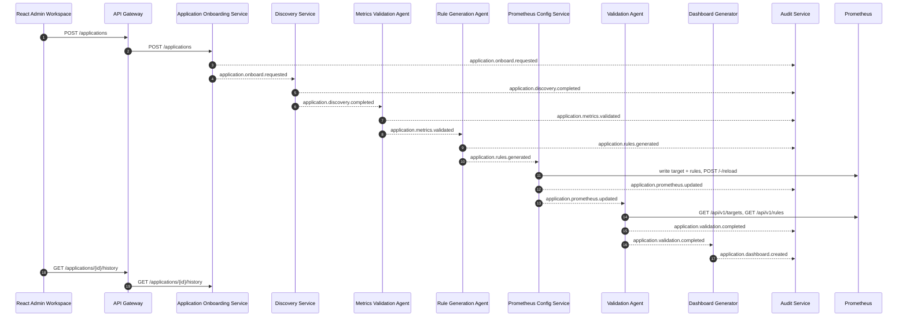
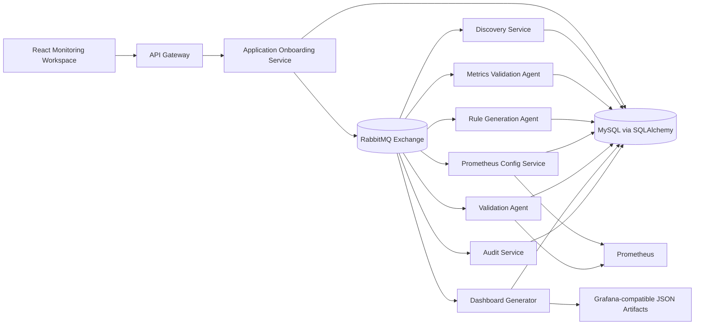
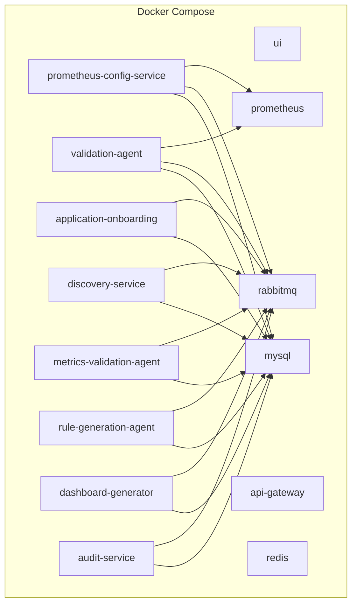
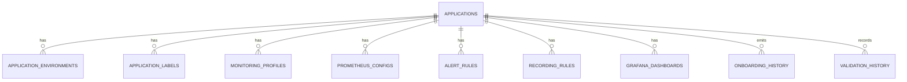

# AI-Driven Prometheus Application Onboarding

## Overview

This design extends KaiOps from incident response into application monitoring onboarding. The implementation follows the existing event-driven service pattern, keeps RabbitMQ as the default control-plane transport, persists onboarding state in the existing SQLAlchemy database layer, and generates Prometheus-compatible scrape targets, alert rules, recording rules, validation results, dashboards, and immutable audit history.

## Sequence Diagram

## Component Diagram

## Deployment Diagram

## Event Flow Diagram

```mermaid
flowchart LR
    A[application.onboard.requested] --> B[application.discovery.completed]
    B --> C[application.metrics.validated]
    C --> D[application.rules.generated]
    D --> E[application.prometheus.updated]
    E --> F[application.validation.completed]
    F --> G[application.dashboard.created]
```

## API Summary

Application Onboarding Service exposes:

- `POST /applications`
- `GET /applications`
- `GET /applications/{id}`
- `PUT /applications/{id}`
- `DELETE /applications/{id}`
- `GET /applications/{id}/history`
- `GET /applications/{id}/validations`
- `GET /applications/{id}/dashboards`

API Gateway proxies the same routes under `/api-gateway/*` for the React UI.

## Database ER Diagram

## Governance Model

Before Prometheus reload, the rule generation stage evaluates:

- naming convention compliance
- duplicate rule names
- namespace ownership presence
- security/compliance label presence

The first implementation returns `approved` or `requires_approval` and persists the decision with immutable audit history.

## Observability

The onboarding services export:

- `applications_onboarded_total`
- `application_discovery_duration`
- `rule_generation_duration`
- `validation_duration`
- `dashboard_generation_duration`
- `onboarding_success_total`
- `onboarding_failed_total`

## ADR

### ADR-001: Reuse Existing SQLAlchemy Persistence Layer

Decision:
Use the existing KaiOps SQLAlchemy repository and current MySQL deployment rather than introducing a parallel PostgreSQL-only persistence path.

Reason:
The current platform already boots schema automatically and all services depend on the same repository conventions. Reusing that layer keeps the onboarding slice deployable in the existing environment.

### ADR-002: Use RabbitMQ as the Default Onboarding Control Plane

Decision:
Publish onboarding lifecycle events onto the existing topic exchange using RabbitMQ consumers and publishers.

Reason:
The current deployment defaults to RabbitMQ for policy and orchestration handoffs. Matching that pattern reduces operational drift and keeps the new services aligned with current message-bus behavior.

### ADR-003: Dynamic Prometheus Targets via File Service Discovery

Decision:
Generate JSON target files under `backend/rag/changes/prometheus_targets` and load them through Prometheus `file_sd_configs`.

Reason:
Prometheus cannot accept dynamic scrape config updates through a direct REST write API. File service discovery plus `/-/reload` provides an idempotent, versionable path that works in Docker Compose and can be adapted for Kubernetes volumes or ConfigMaps later.

### ADR-004: Grafana First Pass Stores Dashboard JSON Artifacts

Decision:
Generate Grafana-compatible dashboard JSON and persist it in the database and API, without requiring a live Grafana provisioning flow in this first pass.

Reason:
The current stack does not yet deploy Grafana. Persisting JSON artifacts keeps the output auditable and immediately usable while leaving a clean extension point for Grafana API provisioning later.