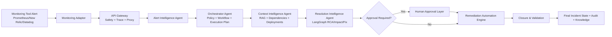
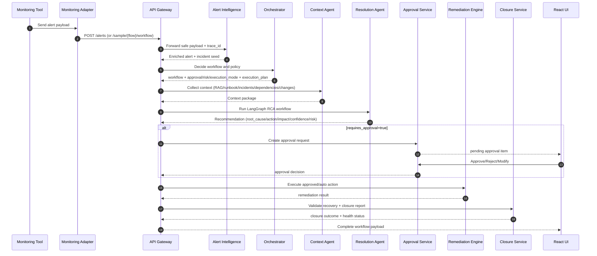

# Complete Application Flow

This document describes the full KaiMS runtime flow from alert ingestion to closure, including how the platform determines:

- how to connect to target systems,
- what commands are allowed and executable,
- what step-by-step playbook to follow.

## 1. High-Level End-to-End Flow

## 2. Runtime Sequence (Detailed)

## 3. How KaiMS Knows Where to Connect

Connection resolution is explicit and catalog-driven.

Primary sources:

- [backend/rag/execution/connectors.json](backend/rag/execution/connectors.json)
- [backend/rag/onboarding/connectivity.json](backend/rag/onboarding/connectivity.json)

Resolution behavior:

1. Use alert service (for example `orders-db`, `payments`) as connector key.
2. Load connector profile:
   - connector_id
   - type (`api`, `kubernetes`, etc.)
   - endpoint or cluster/namespace
   - auth_method
   - secret_ref
   - allowed_operations
3. If no exact connector exists, fall back to `default_connector` (`generic-api`).

This logic is implemented in:

- [backend/src/common/common/orchestration/execution_plan.py](backend/src/common/common/orchestration/execution_plan.py)

## 4. How KaiMS Knows What Commands to Execute

Command knowledge is explicit and governed by an action catalog:

- [backend/rag/execution/action_catalog.json](backend/rag/execution/action_catalog.json)

Each command entry defines:

- operation
- executable command/API expression
- safety level (`read-only`, `reversible`, etc.)
- rollback command (when applicable)

Before execution planning, each command is checked against connector `allowed_operations`. The plan marks command allowability (`allowed=true/false`) per step.

## 5. How KaiMS Knows What Steps to Follow

Step sequencing is playbook-driven:

- [backend/rag/execution/playbooks.json](backend/rag/execution/playbooks.json)

Playbook matching uses:

- service match
- alert keyword match (name/description/source text)

Playbook includes:

- preflight checks
- ordered steps
- approval gates
- command references

If no match is found, KaiMS uses a generic triage playbook fallback.

## 6. Policy and Workflow Decision Layer

Policy and workflow routing determine risk and control mode before execution.

Policy source:

- [backend/src/common/common/orchestration/orchestration_config.json](backend/src/common/common/orchestration/orchestration_config.json)

Runtime components:

- [backend/src/common/common/orchestration/policy_engine.py](backend/src/common/common/orchestration/policy_engine.py)
- [backend/src/common/common/orchestration/workflow_engine.py](backend/src/common/common/orchestration/workflow_engine.py)
- [backend/src/orchestrator/orchestrator/workflow.py](backend/src/orchestrator/orchestrator/workflow.py)

Decision includes:

- workflow
- requires_approval
- risk_tier
- execution_mode
- policy_reason
- message_bus routing
- execution_plan (connection + preflight + steps + commands)

## 7. Approval and Execution Branches

- `requires_approval=true`:
  - Action is paused in Approval Service/UI.
  - Only approved/modified action proceeds to remediation.
- `requires_approval=false`:
  - Action can proceed automatically according to execution mode.

Remediation plugin mapping is in:

- [backend/src/remediation-engine/remediation_engine/plugins.py](backend/src/remediation-engine/remediation_engine/plugins.py)

## 8. Observability and UI Traceability

UI tabs expose operational transparency:

- Summary (root cause/action/impact/policy)
- Agent Events (step-by-step decisions)
- Message Bus Topics
- Execution Plan (connection, preflight checks, command table, rollback)
- Raw Payload

Primary UI file:

- [frontend/react/src/App.jsx](frontend/react/src/App.jsx)

## 9. What Must Exist for Production-Grade Automation

To avoid missing pieces, each critical service should have:

1. Connector profile in [backend/rag/execution/connectors.json](backend/rag/execution/connectors.json)
2. Allowed operations mapped for that connector
3. Command entries in [backend/rag/execution/action_catalog.json](backend/rag/execution/action_catalog.json)
4. Playbook entries in [backend/rag/execution/playbooks.json](backend/rag/execution/playbooks.json)
5. Connectivity endpoints validated in [backend/rag/onboarding/connectivity.json](backend/rag/onboarding/connectivity.json)

## 10. Quick Validation Checklist

1. Trigger a sample flow from UI or gateway.
2. Open Alert Details -> Execution Plan.
3. Verify:
   - connector and auth reference are populated,
   - preflight checks are listed,
   - steps and commands are visible,
   - command `allowed` flags are true for expected operations.
4. Verify policy mode and approval path align with severity/risk.
5. Execute approval + remediation + closure path and confirm final health state.
