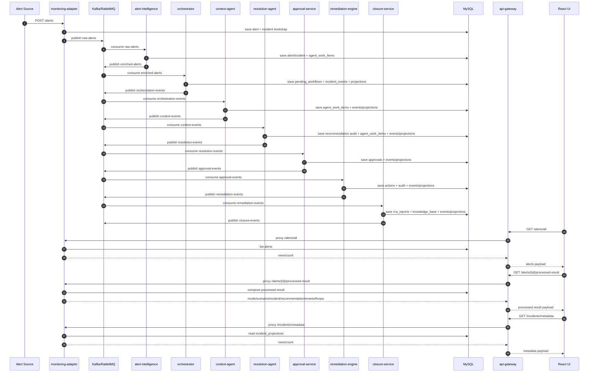

# KaiOps End-to-End Pipeline Trace

This document captures the full operational flow from alert ingestion to UI rendering, including:

- Services called
- Agents called
- Message bus topics
- Database tables touched
- Response payload returned to UI

## 1) End-to-End Sequence

## 2) Service-by-Service Trace Matrix

| Service | Agent / Role | Main Inbound API or Topic | Main Outbound API or Topic | Key DB Tables Touched |
|---|---|---|---|---|
| monitoring-adapter | Ingress + local workflow runner | POST /alerts, POST /alerts/alertmanager, topics: n/a | raw-alerts, GET /alerts/all, GET /alerts/{id}/processed-result, GET /incidents/metadata | alerts, incidents, agent_work_items, incident_events, incident_projections |
| alert-intelligence | Alert Intelligence Agent | raw-alerts | enriched-alerts | alerts, incidents, agent_work_items |
| orchestrator | Orchestrator Agent | enriched-alerts | orchestration-events | pending_workflows, incident_events, incident_projections, agent_work_items |
| context-agent | Context Intelligence Agent | orchestration-events | context-events | agent_work_items, incident_events, incident_projections |
| resolution-agent | Resolution Intelligence Agent | context-events | resolution-events | audit_logs, agent_work_items, incident_events, incident_projections |
| approval-service | Human Approval Layer | resolution-events, POST /approval/{action} | approval-events | approvals, incident_events, incident_projections, audit_logs |
| remediation-engine | Remediation Automation Engine | approval-events (and policy checks) | remediation-events | actions, audit_logs, incident_events, incident_projections |
| closure-service | Closure & Validation (validation-agent) | remediation-events | closure-events | rca_reports, knowledge_base, incident_events, incident_projections |
| api-gateway | Unified edge | UI calls: /alerts/all, /incidents/metadata, /sample/flows, /approval/* | Proxies to monitoring-adapter/approval-service | none (proxy layer) |
| ui/react | Dashboard + Alert Details Workspace | Browser interactions | Calls api-gateway and monitoring-adapter routes via gateway pathing | none |

## 3) Message Bus Flow

| Step | Producer Service | Topic | Consumer Service | Agent Label |
|---|---|---|---|---|
| 1 | monitoring-adapter | raw-alerts | alert-intelligence | Alert Intelligence Agent |
| 2 | alert-intelligence | enriched-alerts | orchestrator | Orchestrator Agent |
| 3 | orchestrator | orchestration-events | context-agent | Context Intelligence Agent |
| 4 | context-agent | context-events | resolution-agent | Resolution Intelligence Agent |
| 5 | resolution-agent | resolution-events | approval-service | Human Approval Layer |
| 6 | approval-service | approval-events | remediation-engine | Remediation Automation Engine |
| 7 | remediation-engine | remediation-events | closure-service | Closure & Validation |
| 8 | closure-service | closure-events | downstream observers/UI reporting | Closure & Validation |

## 4) Database Tables and Their Purpose

| Table | Purpose |
|---|---|
| alerts | Canonical alert payload storage |
| incidents | Incident-level state and payload |
| approvals | Approval decisions and metadata |
| actions | Remediation execution records |
| rca_reports | Closure/validation report outcomes |
| knowledge_base | Post-incident knowledge entries |
| audit_logs | Recommendation/audit actions |
| onboarding_state | Project onboarding and monitoring config records |
| pending_workflows | Orchestrator decision context before full closure |
| agent_work_items | Agent-by-agent execution trace for timelines |
| incident_events | Event-sourced lifecycle contracts |
| incident_projections | Query-optimized metadata for UI tabs |
| roles | User role definitions |
| users | User accounts |
| user_sessions | Authentication sessions |

## 5) Response Received by Alert Details Workspace

For a selected alert ID, UI calls:

- GET /monitoring-adapter/alerts/{alert_id}/processed-result

Returned object shape (high-level):

| Field | Description |
|---|---|
| mode | Processing mode (for example db-processed) |
| scenario | Scenario metadata (id/title/recommended_action) |
| alert | Original alert payload |
| incident | Incident payload |
| decision | Workflow/policy routing outcome |
| recommendation | RCA + recommended action + metadata |
| approval | Latest approval record |
| remediation_action | Latest remediation execution record |
| closure_report | Validation/closure status |
| metrics | Derived status indicators |
| finops | LLM/model usage and cost summary |
| events | Agent step timeline rows |
| next_step | Human-readable next action |

## 6) UI Tab Mapping to Backend Payload

| Alert Details Workspace Tab | Primary Payload Source |
|---|---|
| Summary | alert, incident, recommendation |
| Flow Timeline | alert.created_at + incident.created_at + incidents/metadata latest update |
| Agent Events | events[] (agent_work_items projection) |
| FinOps | recommendation.metadata.model_usage / finops |
| API Gateway | gateway recent requests feed |
| Message Bus Topics | decision + observed routing metrics |
| Execution Plan | recommendation + routing requirements |
| Raw Payload | Entire processed-result payload |

## 7) Runtime Endpoints Most Used by UI

| Endpoint (via UI host) | Backing Service | Purpose |
|---|---|---|
| /api-gateway/alerts/all | monitoring-adapter via gateway | Alert stream list |
| /monitoring-adapter/alerts/{id}/processed-result | monitoring-adapter | Full selected alert details |
| /api-gateway/incidents/metadata | monitoring-adapter via gateway | Metadata/left-panel and timeline enrichment |
| /api-gateway/incidents/closed | monitoring-adapter via gateway | Closed ticket section |
| /api-gateway/sample/flows | monitoring-adapter via gateway | Flow catalog and demo flows |
