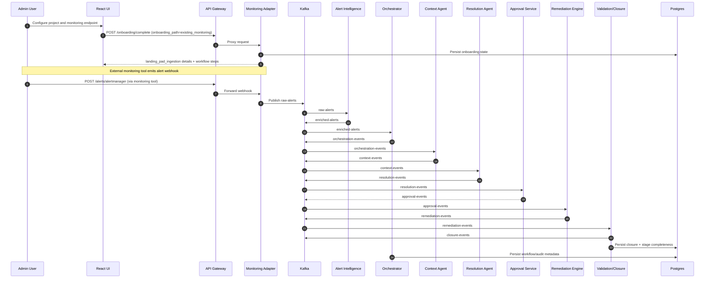
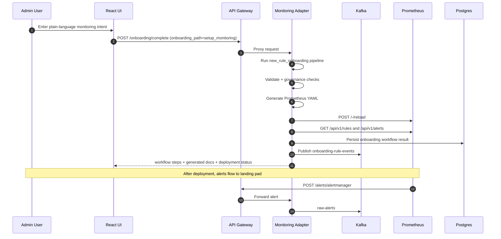
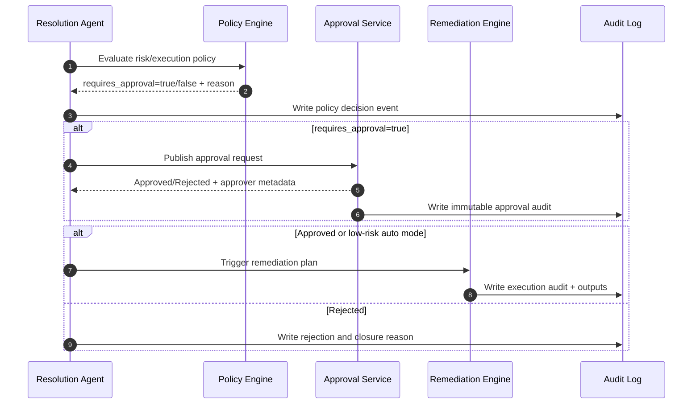

# KaiMS Solution Architecture Document (SAD) v1.0

## 1. Purpose
This document translates the HLD into implementation-ready architecture guidance.

It provides:
1. Runtime sequence diagrams for core flows
2. Event contract templates with deterministic processing controls
3. Security and governance enforcement points
4. Deployment and operational architecture details

## 2. Scope
In scope:
1. Existing Monitoring onboarding path
2. Setup Monitoring onboarding path
3. Runtime incident-resolution flow
4. Event contracts and messaging reliability controls
5. Policy and audit enforcement for high-risk actions

Out of scope:
1. Detailed code-level API schemas for every endpoint
2. Vendor-specific CMDB and ticketing implementation details

## 3. Normative Technology Baseline
1. Primary message bus: Kafka
2. Compatibility bus: RabbitMQ for legacy/selected workflows
3. Local fallback: REST only for local testing
4. Primary RDBMS: PostgreSQL
5. Compatible RDBMS: MySQL via repository abstraction
6. Cache and session state: Redis
7. Knowledge graph: Neo4j (phased)
8. Vector store: Qdrant
9. API and orchestration edge: FastAPI Gateway
10. Agent workflow runtime: LangGraph

## 4. Context and Boundaries
Primary bounded contexts:
1. Onboarding
2. Alert Intelligence
3. Context Enrichment
4. Resolution and Risk
5. Approval
6. Remediation and Validation
7. Closure and Learning
8. Governance and Audit

Cross-cutting controls:
1. Identity and access
2. Policy decision and enforcement
3. Observability and traceability
4. Data protection and retention

## 5. Sequence Diagrams

### 5.1 Existing Monitoring Path (Ingest to Landing Pad)


### 5.2 Setup Monitoring Path (Generate Rules and Deploy)


### 5.3 Runtime Approval and Policy Gate


## 6. Event Contract Templates

### 6.1 Standard Envelope (All Domain Events)
```json
{
  "event_id": "uuid",
  "event_type": "string",
  "event_version": "1.0",
  "occurred_at": "2026-07-14T00:00:00Z",
  "trace_id": "string",
  "correlation_id": "string",
  "causation_id": "string|null",
  "tenant_id": "string",
  "producer": {
    "service": "string",
    "instance": "string"
  },
  "idempotency_key": "string",
  "payload": {},
  "policy": {
    "risk_tier": "low|medium|high",
    "execution_mode": "manual|assisted|autonomous",
    "requires_approval": true
  },
  "security": {
    "classification": "internal|confidential|restricted",
    "contains_pii": false
  }
}
```

### 6.2 raw-alerts Contract
Topic: raw-alerts

| Field | Type | Required | Notes |
|---|---|---|---|
| alert_id | string | yes | Source alert unique ID |
| source | string | yes | prometheus/datadog/etc |
| service | string | yes | Service/system emitting alert |
| severity | string | yes | critical/high/medium/low |
| status | string | yes | firing/resolved |
| fingerprint | string | yes | Dedup fingerprint |
| labels | object | yes | Source labels |
| annotations | object | no | Source annotations |
| starts_at | string (ISO8601) | no | Start timestamp |
| ends_at | string (ISO8601) | no | End timestamp |

Idempotency key:
`tenant_id + source + fingerprint + status`

Retry and DLQ:
1. max_retries: 5
2. backoff: exponential (base 500ms, cap 30s)
3. DLQ topic: raw-alerts.dlq

### 6.3 enriched-alerts Contract
Topic: enriched-alerts

| Field | Type | Required | Notes |
|---|---|---|---|
| incident_id | string | yes | Canonical incident reference |
| alert_id | string | yes | Source alert ID |
| dedup_group_id | string | yes | Correlated group key |
| probable_domain | string | no | Service domain guess |
| enrichment | object | yes | Enriched context attributes |
| confidence | number | no | 0..1 confidence |

Idempotency key:
`tenant_id + incident_id + event_type`

### 6.4 orchestration-events Contract
Topic: orchestration-events

| Field | Type | Required | Notes |
|---|---|---|---|
| incident_id | string | yes | Incident identifier |
| workflow_id | string | yes | Orchestration workflow ID |
| current_stage | string | yes | Current stage marker |
| next_stage | string | yes | Next stage marker |
| decision | object | yes | Routing and policy decision |

Idempotency key:
`tenant_id + workflow_id + current_stage + next_stage`

### 6.5 approval-events Contract
Topic: approval-events

| Field | Type | Required | Notes |
|---|---|---|---|
| incident_id | string | yes | Incident identifier |
| recommendation_id | string | yes | Proposed action ID |
| decision | string | yes | approved/rejected |
| approver | string | yes | Human identity |
| reason | string | no | Optional rejection reason |
| approved_at | string (ISO8601) | yes | Decision timestamp |

Idempotency key:
`tenant_id + recommendation_id + decision`

### 6.6 closure-events Contract
Topic: closure-events

| Field | Type | Required | Notes |
|---|---|---|---|
| incident_id | string | yes | Incident identifier |
| closure_status | string | yes | closed/failed |
| health_restored | boolean | yes | Validation outcome |
| closed_at | string (ISO8601) | yes | Closure timestamp |
| summary | object | no | Final summary payload |

Idempotency key:
`tenant_id + incident_id + closure_status`

## 7. Consumer Reliability Controls
Each consumer must implement:
1. Idempotent processing by idempotency key with persistent dedup store
2. At-least-once safe semantics
3. Retry with bounded attempts
4. DLQ publish on terminal failure
5. Replay support from offset/time window

Recommended dedup TTL:
1. Hot path: 24 hours
2. Critical approvals/remediation: 7 days

## 8. Security and Governance Enforcement Points

| Control | Enforcement Point | Owner | Evidence |
|---|---|---|---|
| JWT validation | API Gateway auth middleware | Platform Security | Gateway auth logs |
| RBAC/ABAC | Gateway + policy engine | IAM + App Teams | Decision audit records |
| Prompt sanitization | Gateway pre-LLM path | AI Platform | Prompt safety logs |
| Output validation | Agent runtime post-LLM | AI Platform | Validation event records |
| Approval gate | Approval service | Operations Governance | Immutable approval events |
| Side-effect policy check | Orchestrator/Resolution | Policy Team | Policy decision events |

## 9. Data and Retention Model

| Data Class | Store | Retention | Notes |
|---|---|---|---|
| Incident workflow state | PostgreSQL | 365 days | Partition by tenant/date |
| Immutable audit log | PostgreSQL | 730 days | Write-once append model |
| Operational metrics/traces | Prometheus/Loki/Tempo | 30-90 days | Tiered storage optional |
| Vector knowledge entries | Qdrant | 365 days | Reindex quarterly |
| Session/cache state | Redis | Minutes-hours | Non-authoritative |

PII handling:
1. Mask at ingestion where possible
2. Encrypt sensitive fields at rest
3. Restrict retrieval by tenant and role

## 10. Deployment Views

### 10.1 Local Development
1. Docker Compose stack
2. Single-node dependencies
3. Optional REST fallback for quick testing

### 10.2 Production
1. Kubernetes with horizontal scaling for stateless services
2. Kafka HA cluster
3. PostgreSQL HA with backups and PITR
4. Redis HA
5. Optional Neo4j and Qdrant clusters per phase
6. OTEL, Prometheus, Loki, Tempo integrated

## 11. Operational SLOs

| SLI | Target |
|---|---|
| API availability | >= 99.9% |
| API latency p95 | < 2s |
| AI recommendation latency p95 | < 5s |
| Event processing lag p95 | < 10s |
| DLQ recovery SLA | <= 30 minutes |
| RTO | <= 60 minutes |
| RPO | <= 15 minutes |

## 12. Implementation Checklist
1. Finalize canonical topic list and event schema registry
2. Enforce idempotency in all critical consumers
3. Implement policy-evaluation pre-check for side effects
4. Ensure all approval outcomes are immutable and queryable
5. Add replay tooling for DLQ topics
6. Validate tenant isolation in API, storage, and events
7. Verify both onboarding paths in E2E pipeline

## 13. Appendices
### Appendix A: Topic Naming Convention
1. Domain event topics: `<domain>-events`
2. Dead-letter topics: `<topic>.dlq`
3. Retry topics (if used): `<topic>.retry.<n>`

### Appendix B: Versioning Rules
1. Backward-compatible changes: minor version bump
2. Breaking payload changes: major version bump
3. Keep envelope stable; evolve payload with schema registry
