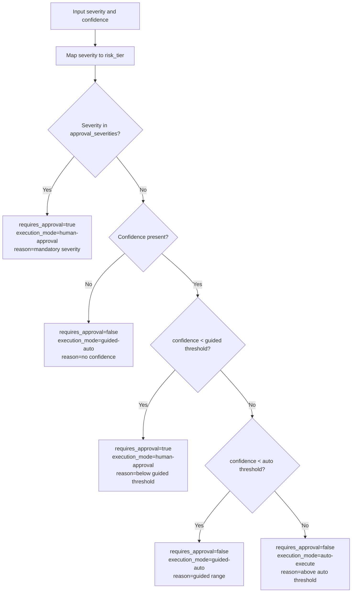
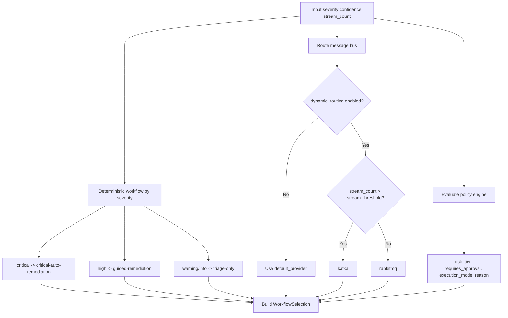
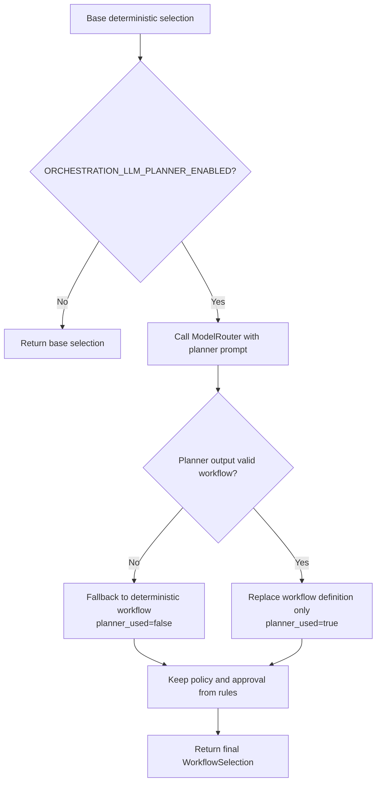
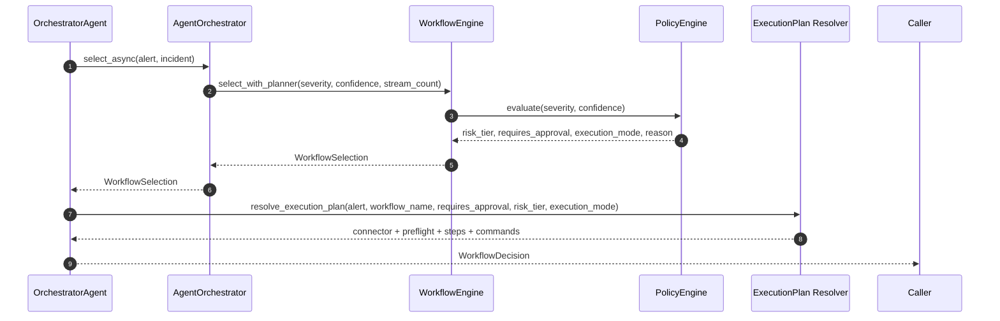
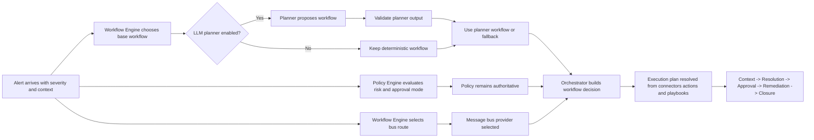
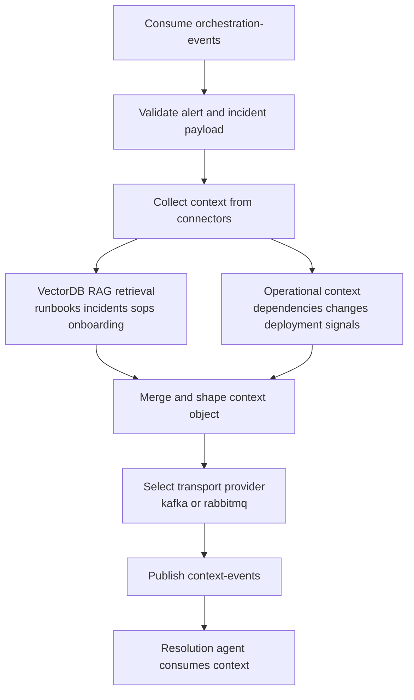
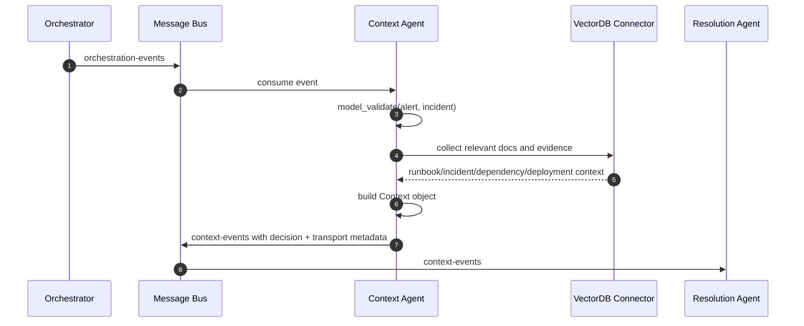

# Policy, Workflow, and AI Orchestrator Flow

This document describes how KaiMS makes orchestration decisions using:

- Policy Engine (authoritative risk and approval rules)
- Workflow Engine (workflow and bus routing)
- AI planner (optional advisory planner)
- Orchestrator Agent (final decision assembly)

## 1. Policy Engine Flow

Source: `backend/src/common/common/orchestration/policy_engine.py`

Outputs:

- `risk_tier`
- `requires_approval`
- `execution_mode`
- `reason`

## 2. Workflow Engine Flow

Source: `backend/src/common/common/orchestration/workflow_engine.py`

`WorkflowSelection` contains:

- workflow definition (`name`, `steps`, `next_action`)
- policy outputs (`risk_tier`, `requires_approval`, `execution_mode`)
- message bus choice (`message_bus_provider`, `stream_count`, `stream_threshold`)

## 3. AI Planner Flow (Advisory)

Source: `WorkflowEngine.select_with_planner()` and `_plan_workflow_name()`

Planner is advisory only. Policy remains authoritative.

## 4. AI Orchestrator Agent Flow

Source: `backend/src/orchestrator/orchestrator/workflow.py`

`WorkflowDecision` includes:

- `workflow`, `next_action`, `downstream_agents`
- `requires_approval`, `risk_tier`, `execution_mode`
- `policy_version`, `policy_reason`
- `planner_used`, `planner_model`, `planner_reason`
- `message_bus_provider`, `stream_count`, `stream_threshold`
- `execution_plan`

## 5. Combined End-to-End Decision Flow

## 6. Guardrails and Guarantees

- Severity gates can force approval regardless of planner output.
- Invalid planner output never breaks flow; deterministic fallback is automatic.
- Policy metadata (`risk_tier`, `execution_mode`, `policy_reason`) is propagated in orchestration outputs.
- Execution plan is resolved after workflow selection using connector, action catalog, and playbook data.

## 7. Context Engine Flow

Sources:

- `backend/src/context-agent/app.py`
- `backend/src/context-agent/context_agent/connectors.py`

### Context Engine Example

Example alert: `payments-webhook-retry-storm`

1. Orchestrator publishes `orchestration-events` with incident, alert, and decision metadata.
2. Context agent consumes the event and validates both payloads into `Alert` and `Incident` models.
3. Context collection retrieves RAG evidence for webhook retries, related incidents, and operational dependencies.
4. Context agent builds a consolidated `Context` object containing:
   - related incidents
   - dependency services
   - recent changes and deployment hints
   - runbook/SOP evidence
5. Context agent publishes `context-events` on the selected bus provider (kafka or rabbitmq).
6. Resolution agent consumes `context-events` and performs RCA and recommendation generation with grounded context.

### Runtime Notes

- Context agent receives orchestration events from both kafka and rabbitmq workers when enabled.
- Outbound context event transport is selected from decision metadata with a rabbitmq fallback.
- Context publishing includes decision and transport markers used downstream for explainability.
